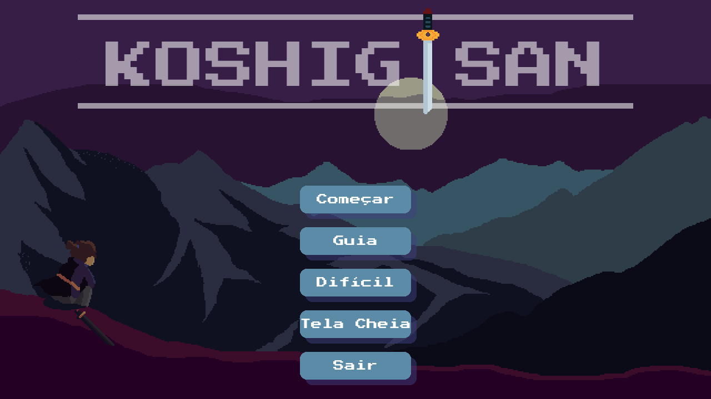
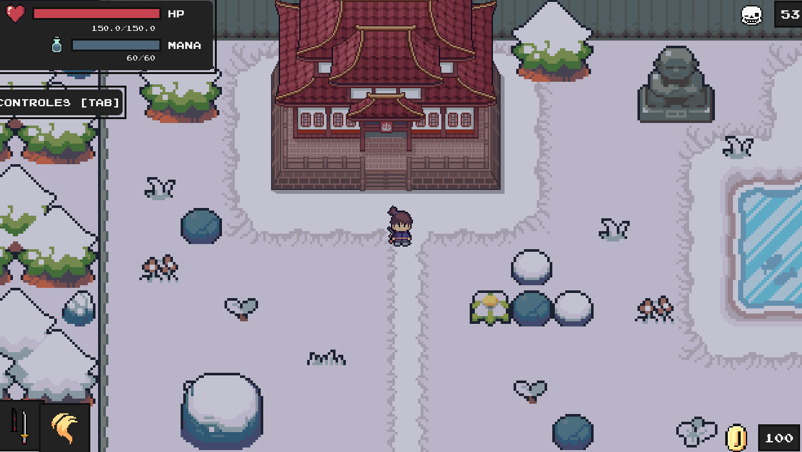
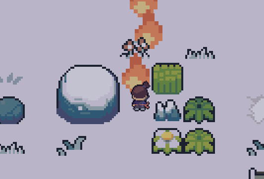

# Koshigisan Prototype

 
Koshigisan Prototype is a TopDown 2D game made with Pygame for a college project. The game is a prototype of a bigger project that will be made in the future, using GameMaker Studio 2.

## Requirements

- Python 3.10+
- Pygame (`pip install pygame`)

## How to run

- Clone the repository
- Run `python main.py`

## Controls

- Use the arrow keys to move
- Use LShift to interact with objects
- Use Z to attack with magic
- Use X to attack with sword

## Objectives

- Kill all the enemies in the map

## Credits

- [Daniel Nascimento - Programmer/Director](http://github.com/DanielNasc)
- [Luann - Programmer/Sounds](https://github.com/Lonalt)
- [Luma - Programmer/Characters and Enemies](https://github.com/Sahinake)
- [Helpful Pygame Tutorial](https://youtu.be/QU1pPzEGrqw)
- [Pygame Documentation](https://www.pygame.org/docs/)
- [Decoration/UI/Scenary Assets](https://pixel-boy.itch.io/ninja-adventure-asset-pack)
- [Japanese Buildings](https://www.deviantart.com/peekychew/gallery)

